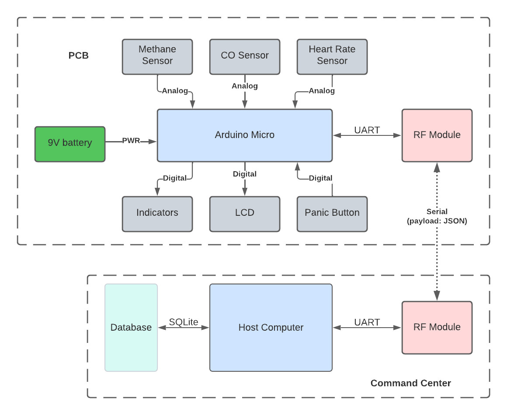
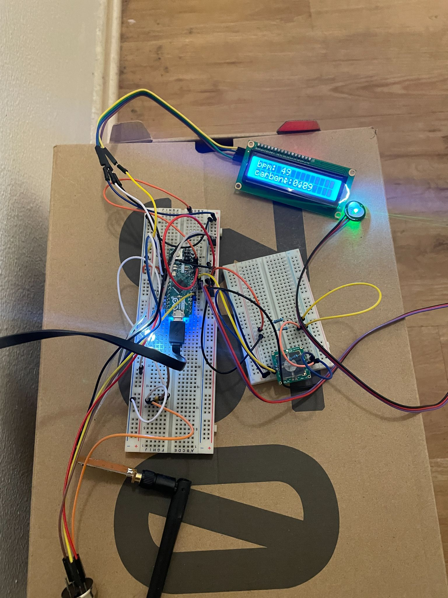

# watchguard-microcontroller

The microcontroller portion of the WatchGuard project. This portion is responsible for the code that executes the wearable device hardware.

## WatchGuard

WatchGuard is a team project for the University of California, Irvine electrical engineering and computer science department's senior design project (Fall 2022 to Winter 2023).

The goal of WatchGuard is to reduce the harm experienced and fatalities of firefighters and other first responders in dangerous and extreme environments by providing more awareness and security to the user. WatchGuard has two primary views: a central control view and an on-the-field wearer. The wearer is the user that wears the device, while the person from the control view manages those devices and will delegate necessary support from information received from the wearers.

The wearable WatchGuard device observes biological metrics of the wearer such as their heartbeat, as well as those in the environment such as gas levels. These metrics are sent to the control view via radio frequency to be monitored by the person in charge of the control view. This ensures that the firefighters and first responders wearing this device can be accounted for in adverse conditions.

A broad overview of the project can be found below. However, the focus of the repository is on the Arduino Micro.

The prototype breadboard can be found below.

